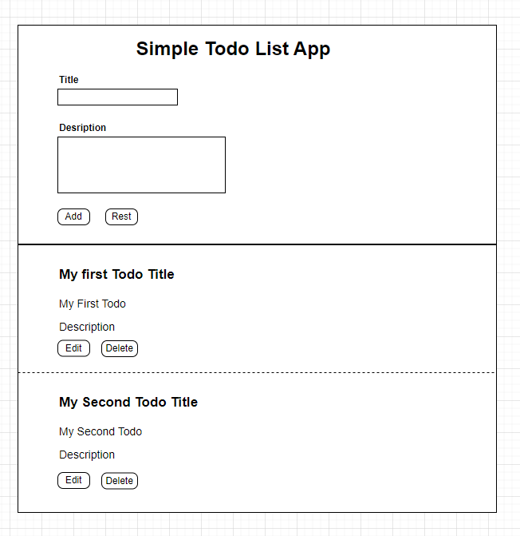

Write a class Based Component, this Component will have a form with 2 fields “title”, and “description” (input text, input text area), and 2 buttons:
The first button with the label “Add”.
The second button with the label "Reset".
- When the user clicks add button the form fields will be cleared, and the input user entered will be shown as a grid each entry formatted as a title in Bold and a description below it, each entry of gird will have also 2 buttons to delete and edit.

- When a user clicks the reset button, form fields will be cleared only.

- When the user clicks the edit button at the added entry record, the form will be populated with edited data and the user can edit and update a gain, (please note in edit mode the label of Add button will be changed to “update”) 
When the user clicks delete this entry will be deleted

Please let me know if you have any questions.
